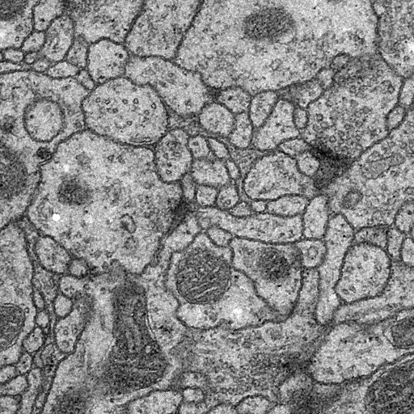
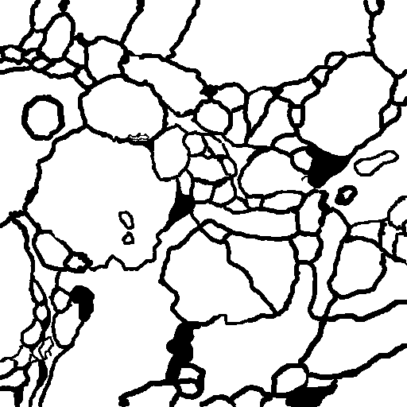
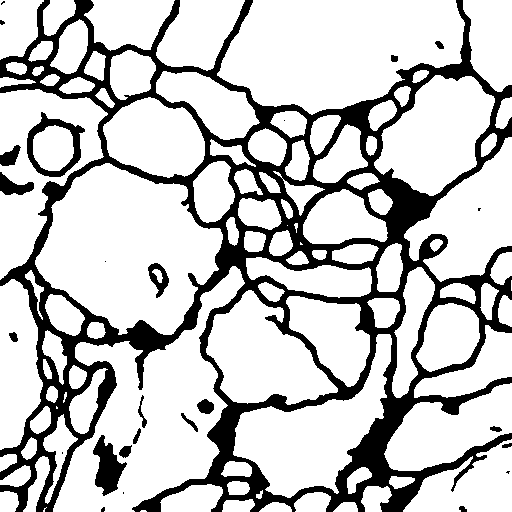

# CS420-Course-Project

### File description:

- --`dataset`: all the data

- --`log`: training logs

- --`model`: stored model

- --`ISBIdataset.py`: dataset class

- --`model.py`: model class

- --`main.py`: main file used for training and testing

- --`predict_test.py`: used for predict test images, predict images are stored in `dataset/predict_test`

### Quick start:

make sure you have installed all the packages.

```shell
python main.py #used for train, parameters can be adjust in main.py file
```

The result is stored in the `log.csv` file.

```shell
python predict_test.py #used for predict test images
```

### Performance:

| Time | Vrand  | Vinfo  |                    Remarks                    |
| :--: | :----: | :----: | :-------------------------------------------: |
| 6/13 | 0.9820 | 0.9836 |   Adjust parameters (Batch size=2, lr=1e-3)   |
| 6/14 | 0.9823 | 0.9837 |   Adjust parameters (Batch size=2, lr=2e-3)   |
| 6/16 | 0.9716 | 0.9804 | Data augmentation. No significant improvement |

<center class="half">
    
    
    
</center>

The first image is one of the test image (`"0.png"`). The second one is the test label. And the last one is the predict of our model with best performance. You can see that the performance is better, only few details are missing or wrong.

### Work Logs:

- 2021/6/13: adjust parameters, the best parameters are: batch size = 2, learning rate= 1e-3

- 2021/6/14: adjust parameters

- 2021/6/15: adjust parameters

- 2021/6/16: data augmentation :  Use `cv2.copyMakeBorder()` to do boundary expansion image augmentation. No significant improvement.

  

  -------------------------------------------------------------------------------------------------------------------------------------------------------------------------------------

  ​																		Prepare for the exam, no more experiments.
  
  -------------------------------------------------------------------------------------------------------------------------------------------------------------------------------------

### To Do:

- [ ] Model modification 

- [x] Parameters adjustment

- [x] Data argumentation

- [ ] Change loss function

